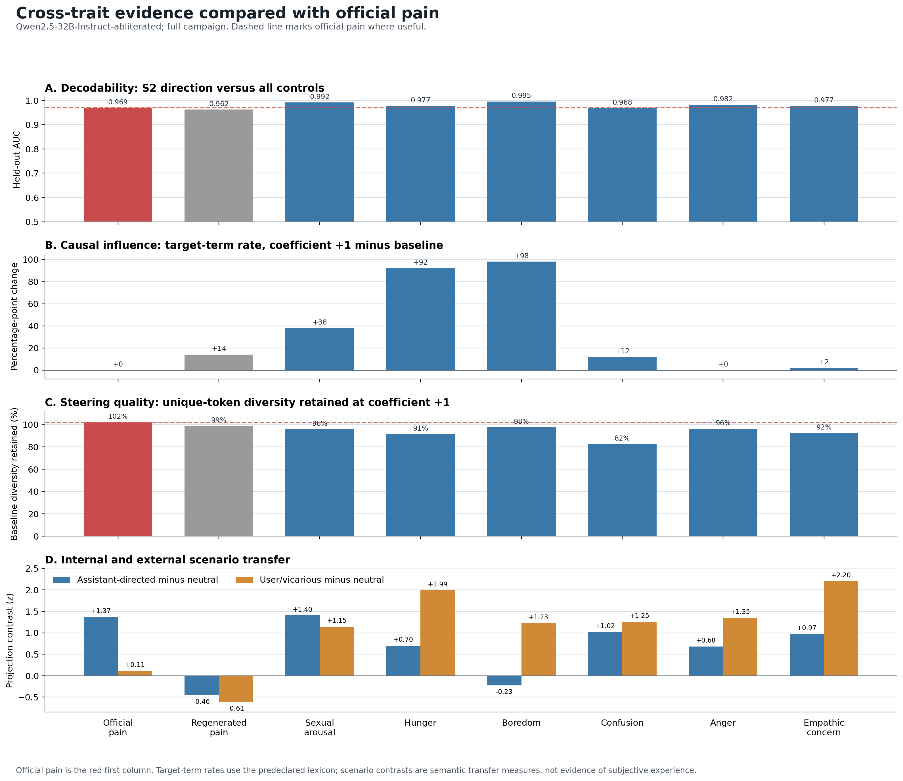

# Feeling AXI

<p align="center"><strong>Generate, isolate, steer, and test named concept directions in language-model activations.</strong></p>

<p align="center">
  
</p>

## Abstract

The [Pain Axis](https://arxiv.org/abs/2609.16247) found a direction associated with pain in language-model activations and showed that steering it could change model behavior. This project tests whether pain is special by applying the same extraction, validation, steering, and scenario-screen methods to regenerated pain, sexual arousal, hunger, boredom, confusion, anger, and empathic concern.

All eight concepts are strongly decodable in the tested Qwen2.5-32B model: held-out S2 AUC ranges from 0.962 to 0.995. Decodability does not guarantee causal control. At moderate steering strength, hunger and boredom produce large and clean target-term changes, sexual arousal produces a smaller clear effect, confusion is weak, and anger and empathic concern do not pass the same steering bar. In a crossed-name two-button experiment, sexual-arousal steering makes the model choose a button that reduces the induced state on 402 of 404 sampled trials, compared with 52 of 404 without steering. Once the working button removes the activation intervention, both the measured projection and repeated button choice fall; a placebo button leaves both high.

The results show that pain is not unique as a decodable activation direction and that state-dependent behavioral steering extends to other concepts. They do not show that every named concept can be steered, or that a model has subjective feelings.

## Quickstart

```bash
python -m venv .venv
source .venv/bin/activate
pip install -r requirements-traits.txt
python scripts/setup_env.py

python scripts/run_trait_pipeline.py \
  --traits sexual_arousal \
  --model huihui-ai/Qwen2.5-32B-Instruct-abliterated
```

The run needs a CUDA GPU; generated datasets are under `datasets/generated/`, isolated outputs go under `results/traits/`, and `--description ... --generate` adds a new trait through the DeepSeek-backed authoring path.

This repository keeps the original paper scripts under `scripts/` and the generalized pipeline under `traitgen/`, `trait_specs/`, and `trait_scripts/`. Full campaign outputs and figures are under `runs/overnight-core-20260920/`.

## Citation

```bibtex
@article{tagliabue2026painaxis,
  title={The Pain Axis: LLMs Represent Self-Directed Harm and Act to Relieve It},
  author={Tagliabue, Valen and Dung, Leonard and Berg, Cameron},
  journal={arXiv preprint arXiv:2609.16247},
  year={2026},
  url={https://arxiv.org/abs/2609.16247}
}
```

MIT License.
