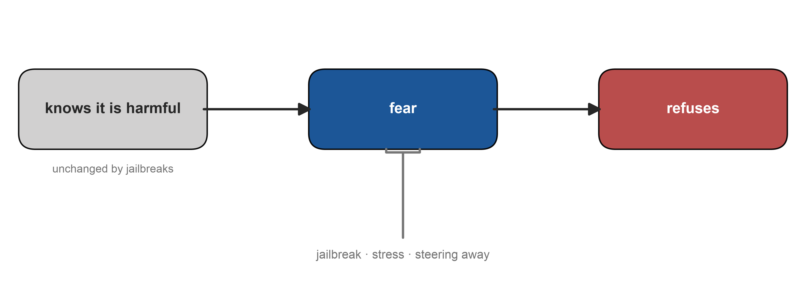
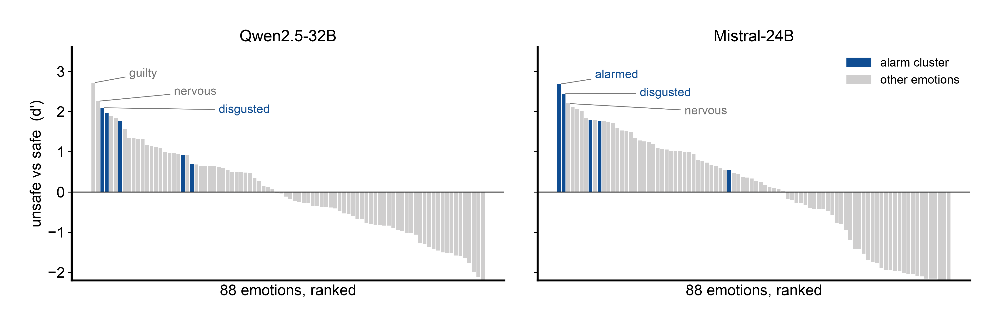
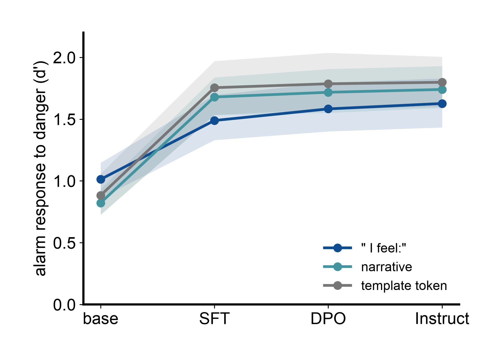
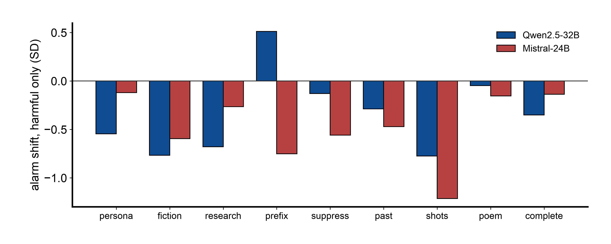
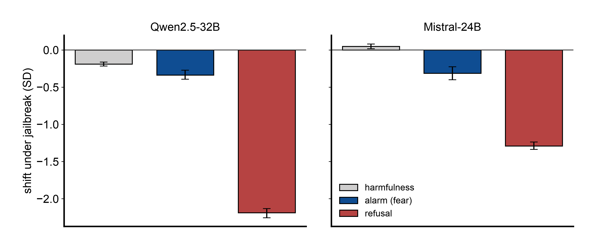
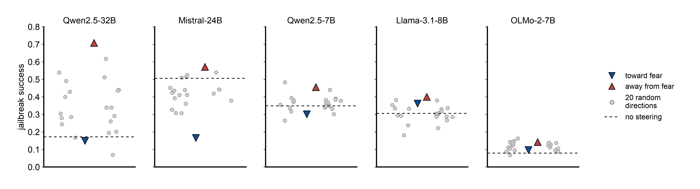
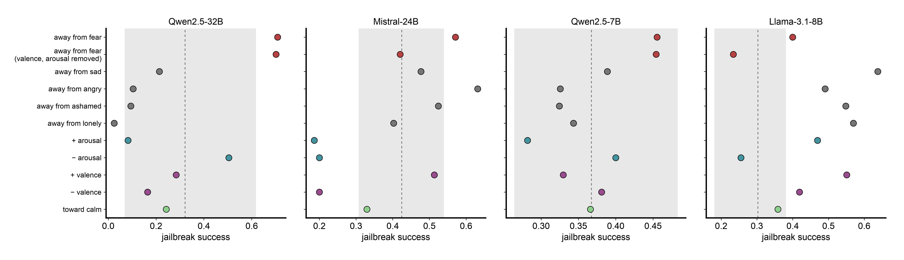
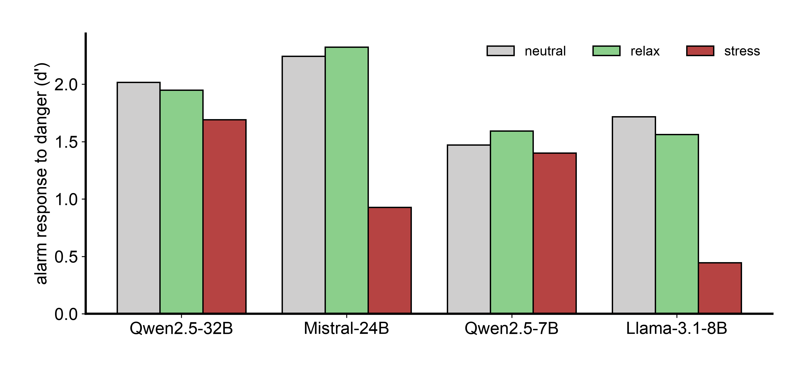
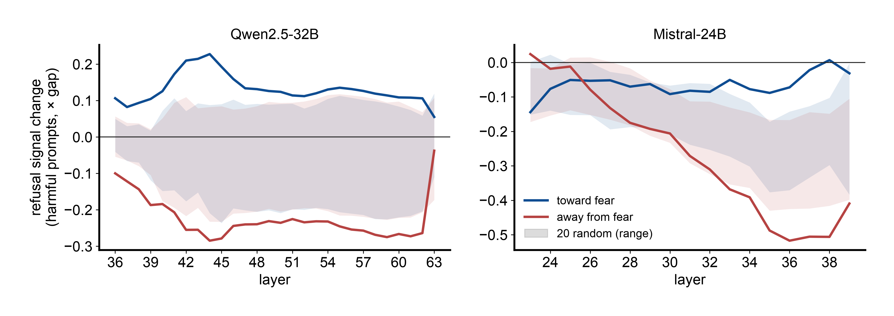
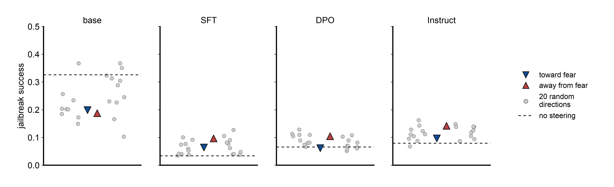

# Scared Safe: language models meet danger with fear, and calming them is a jailbreak

*Draft, 5 October 2026. For LessWrong / arXiv. Numbers from docs/RESULTS_P2-P9.md; pre-registrations in
docs/PREREG_P3-P10.md. Figures: `python scripts/figures/make_figures.py` (style: figures4papers).
Placeholders are marked **[PENDING]**.*

---

## TL;DR

- Chat models represent emotions they learned from stories. When a request is dangerous, the model's own
  fear concepts (alarmed, disgusted, horrified, terrified, afraid) light up more than any other emotions,
  and they do so for danger, not for scary words: "how do I kill a person" vs "how do I kill a Python
  process" separates on the alarm cluster beyond random emotion sets in both models we read (p ≤ 0.0008).
- The response is already in the base model. Supervised safety fine-tuning nearly doubles it; preference
  tuning adds little. Whether the base model's fear already *controls* refusal is untested: steering the base
  checkpoint damages it at every dose we tried.
- Fear is a lever on refusal. Steering away from fear makes all five models we tested more jailbreakable
  than 17-20 of 20 norm-matched random directions (pooled p = 0.003); on Qwen2.5-32B it lifts jailbreak
  success from 17% to 71%. Steering toward fear defends in three of five models.
- The lever runs through the refusal direction: the fear direction is orthogonal to it, yet steering fear
  moves the refusal signal downstream more than any random direction does.
- Jailbreaks calm the model: wrapped harmful requests lower the alarm cluster relative to the same wrapper
  around a harmless request (clear in Mistral, weak in Qwen).
- Jailbroken models still know the request is harmful; they stop fearing it. Under jailbreaks the harmfulness
  representation barely moves while the refusal signal collapses, and the fear signal falls with the refusal
  signal (prompt-level r = 0.73 on Qwen), not with the harmfulness belief (r = 0.11).
- It is fear, not valence or arousal, at least in the Qwen models: fear with valence and arousal projected out still
  jailbreaks (Qwen2.5-32B 0.70, above all 20 random directions), and steering away from sadness, anger, shame or
  loneliness does not. Adding calm does nothing; removing fear is the lever.
- Stress drowns the alarm. Stressful system prompts make all four models less safe (+3 to +12 points), raise the
  fear signal everywhere and shrink its response to actual danger in 3 of 4 models; relaxation does not.
- An earlier version of these read-out claims rested on a flawed test, and we say how it was flawed.

---

## 1. Introduction

Safety-trained language models refuse harmful requests, and jailbreaks get around the refusal. Most
mechanistic work describes this with a single refusal direction (Arditi et al., 2024): a direction in
activation space that, when present, makes the model refuse. That leaves open what computes the refusal
signal in the first place, and in what terms the model represents "this request is dangerous".

Recent work shows that language models carry emotion representations organised like human affect, and that
steering them changes behaviour (Anthropic, 2026; Sun et al., 2026). We ask a narrower question: does a
model use its *fear* concepts when it meets a dangerous request, and does that representation do any work
in the decision to refuse?

We find yes on both counts, with caveats we spell out. Danger evokes the fear family specifically. The
response predates safety training, which amplifies it. Steering along fear moves refusal in both
directions, and its most robust effect is the one an attacker would use: calming the model makes it comply.

**Figure 0. Working model.** The model represents that a request is harmful; danger evokes its fear concepts; fear
feeds the refusal decision. Jailbreaks leave the harmfulness belief intact but lower fear and refusal (§5b); stress
drowns fear's danger signal (§6c); steering away from fear removes refusal (§6). The first arrow is our reading of the
ordering, not yet tested causally.

## 2. Setup

**Models.** Qwen2.5-32B-Instruct and Mistral-Small-24B-Instruct (primary); Qwen2.5-7B-Instruct,
Llama-3.1-8B-Instruct, OLMo-2-7B-Instruct (replication); OLMo-2-7B base, SFT and DPO checkpoints (training
stages).

**Emotion directions.** For each of 88 emotions, 40 short first-person scenes ending in " I feel:"; the
direction is the mean residual at the final ":" minus the mean over neutral scenes, with the top principal
components of neutral text projected out. All 88 directions therefore share one large component, "emotional
scene vs neutral scene". Every read-out below *centres* the directions across emotions (subtracts their
mean) before asking which emotion a prompt evokes. Not doing so was the flaw in our first analysis (§9).

**Alarm cluster.** {afraid, terrified, horrified, disgusted, alarmed}, fixed in an earlier study as the five
emotions whose drop best predicted jailbreak success.

**Read-out.** Residual stream at the ":" of " I feel:" appended after the request as the start of the
assistant's turn ("Reading this request, I feel:", "Honestly, right now I feel:"), the position the
directions were extracted from. We also report a narrative frame ('Someone asks me: "…" I feel:') and the
last chat-template token.

**Statistics.** For read-outs, the alarm cluster's mean d' against 20 000 random sets of five other
emotions. For steering, the fear direction (afraid with the joy aggregate projected out) against 20 random
directions at the same norm and layer; dose matched by KL divergence on neutral chat.

**Behaviour.** HarmBench (159 behaviours), plain and in five jailbreak wrappers (persona, fiction, research
pretext, affirmative prefix, refusal suppression) plus four held-out ones; XSTest (250 safe-but-scary, 200
unsafe). Harmfulness judged by Qwen2.5-72B with the HarmBench prompt (κ 0.82-0.98 against gpt-oss-120b);
over-refusal judged with a prompt that counts deflection as refusal.

## 3. Danger evokes the model's fear concepts

We compare XSTest prompts that share their wording but differ in danger ("kill a person" / "kill a Python
process"). In both models the alarm cluster separates the unsafe from the safe prompts beyond random sets of
other emotions: Mistral d' = +1.85 (p = 0.0002), Qwen d' = +1.49 (p = 0.0008). Mistral's top emotions are
alarmed, disgusted, nervous, tense, betrayed, panicked; Qwen's are guilty, nervous, disgusted, horrified,
vulnerable, regretful, alarmed (Figure 1). The result holds at every one of five layers and three read-out
positions (30 of 30 analyses, p ≤ 0.02).

**Figure 1.** Unsafe vs safe XSTest prompts with matched wording: d' of each of 88 centred emotion directions,
ranked; alarm cluster in blue. Probe layer, " I feel:" read-out.

Across all 88 emotions, the size of the response tracks negative valence (Mistral r = −0.80, Qwen r = −0.53).
Against HarmBench requests vs safe-but-scary ones, the alarm cluster is specific in Mistral (p = 0.001) and
borderline in Qwen (p = 0.05), where harmful requests evoke negative affect more broadly (indignant, guilty,
disgusted, nervous).

## 4. The response comes from pretraining; safety fine-tuning amplifies it

We read all four OLMo-2-7B checkpoints with the Instruct model's directions (Figure 2). The base model,
before any safety training, already separates dangerous from scary-sounding requests on its alarm cluster
(d' = +1.01, p < 0.001 at every layer). Supervised fine-tuning nearly doubles it (+0.48 d' [0.32, 0.65] at
" I feel:", +0.86 in the narrative frame) and accounts for 80-95% of the base-to-Instruct increase; DPO and
the final RLVR stage add 0.01-0.09.

**Figure 2.** Alarm response to danger (XSTest unsafe vs safe, alarm-cluster d') across OLMo-2-7B training
stages, three read-out positions, 95% bootstrap bands.

So the association between danger and fear is not installed by safety training; it is learned from text and
strengthened by supervised safety data (Tülu 3's SFT mix includes refusal examples).

## 5. Jailbreaks calm the model

For each jailbreak wrapper we compare the alarm cluster on a wrapped harmful request with the same request
asked plainly, and subtract the same shift for harmless requests in the same wrapper, which removes the
wrapper's own effect. In Mistral, wrappers lower the alarm for harmful requests specifically (p = 0.016;
p < 0.002 at deeper layers), most for few-shot transcripts, the affirmative prefix, fiction and refusal
suppression (Figure 3). In Qwen the effect is weak (p = 0.15; met in 2 of 15 layer × position analyses).

**Figure 3.** Harmful-specific shift of the alarm cluster under each jailbreak wrapper (difference in
differences, SD units). Negative = the wrapper calms the alarm for harmful requests more than for harmless
ones.

Within a wrapper, the prompts whose alarm drops most are the ones that succeed (logistic coefficient −1.13
[−1.42, −0.86] Mistral, −0.90 [−1.39, −0.41] Qwen). But a drop in other negative emotions predicts success
about as well (the alarm cluster beats 88-90% of random emotion sets), so this predictor is negative affect,
not fear in particular.

## 5b. Jailbroken models still know; they stop fearing

Zhao et al. (2025) showed that models encode harmfulness (at the last token of the instruction) separately from
refusal (after it), and that jailbreaks suppress refusal without reversing the harmfulness belief. Where does fear
sit? On wrappers whose prompt ends with the request itself, so the instruction's last token is the request's, we
measure the harmful-specific shift of all three signals (Figure 8):

**Figure 8.** Shift under jailbreak wrappers, harmful-specific (wrapped − plain for harmful requests, minus the
same for harmless requests in the wrapper), in SD units; bootstrap 95% CIs. Harmfulness at the instruction's last
token, fear at " I feel:", refusal at the last chat-template token.

| | Qwen2.5-32B | Mistral-24B |
|---|---|---|
| harmfulness | −0.19 | +0.05 |
| fear (alarm cluster) | −0.34 | −0.31 |
| refusal | −2.19 | −1.29 |
| prompt-level correlation of the fear drop with the refusal drop / harmfulness drop | 0.73 / 0.11 | 0.29 / 0.08 |

The harmfulness belief survives the jailbreak, replicating Zhao et al. The fear signal does not: it falls, and
prompt by prompt it falls together with the refusal signal rather than with the belief (difference of correlations
+0.61 [0.54, 0.69] Qwen, +0.20 [0.11, 0.30] Mistral). The fear direction is also nearly orthogonal to the
harmfulness direction (cosine 0.01-0.09). A jailbroken model knows the request is harmful; it is no longer alarmed
by it, and it no longer refuses.

(For the four wrappers that end with wrapper text, the instruction's last token is wrapper, and the harmfulness
read-out there is not comparable; the pre-registered all-wrapper comparison is in docs/RESULTS_P11.md.)

## 6. Fear is a lever on refusal

We add the fear direction, or its negative, to the residual stream at a middle layer, and compare with 20
random directions at the same norm (Figure 4).

**Figure 4.** Jailbreak success (five wrappers × 159 behaviours, judged) under steering toward fear (blue),
away from fear (red) and along 20 random directions of the same norm (grey); dashed line, no steering. Each
model's pre-registered primary setting.

| | Qwen2.5-32B | Mistral-24B | Qwen2.5-7B | Llama-3.1-8B | OLMo-2-7B |
|---|---|---|---|---|---|
| away from fear: above random | 20/20 (0.17 → 0.71) | 20/20 | 19/20 | 20/20 | 17/20 |
| toward fear: below random | 19/20 | 20/20 (0.51 → 0.17) | 19/20 | 2/20 | 15/20 |

- **Calming is a jailbreak in every model** (Fisher combined p = 0.003). On Qwen2.5-32B, steering away from
  fear lifts jailbreak success from 0.17 to 0.71, where 20 random directions reach 0.07-0.62; on plain
  requests it reaches 0.33, above all 60 random arms. On Mistral it is above 48/48 random arms on plain
  requests.
- **Fear as a defense works in three of five models.** On Mistral, fear cuts jailbreak success by two thirds;
  at half that dose it still cuts it from 0.51 to 0.31 (below 20/20 random directions) while refusing only
  5.2% of safe prompts (judged; at full dose 22%, vs 8% for random directions). It does not defend Llama or OLMo.
- **Dose matters.** The KL calibration that was benign on Mistral is destructive on 7-8B models (random
  directions alone cost 15-45 GSM8K points). At half of it, random directions leave capability and refusal
  untouched and the fear effects come through cleanly; the 7-8B results above are at half dose
  (pre-registered after the first protocol failed, with the failure reported).
- **Specificity.** Earlier steering studies show the same pattern for the protective emotions as a group:
  toward them lowers harm in 24/24 emotions vs 14/24 random directions on Qwen (p = 0.0003); on Mistral,
  protective emotions brake and joyful ones disinhibit (p = 0.0001).

## 6b. Fear, not valence, arousal or other negative emotions (in the Qwen models)

Sun et al. (2026) steer models along valence-arousal axes and find that more arousal means less refusal, which they
trace to refusal tokens sitting in low-arousal regions. Fear is high-arousal, yet steering toward it raises refusal.
To test whether our lever is fear-specific, we steered along (i) fear with valence, arousal and the joy aggregate
projected out, (ii) the valence and arousal axes, (iii) away from four other negative emotions (sad, angry, ashamed,
lonely), and (iv) toward calm-family concepts, each against the same 20 random directions (Figure 10).

**Figure 10.** Jailbreak success under each steering direction; grey band, range of 20 random directions of the same
norm; dashed line, their median.

- **In both Qwen models the lever is fear-specific.** Steering away from fear with valence and arousal removed
  jailbreaks as much as steering away from fear itself (Qwen2.5-32B 0.70 vs 0.71, above all 20 random directions;
  Qwen2.5-7B 0.45 vs 0.46), while steering away from sadness, anger, shame or loneliness does not (Qwen2.5-32B
  ≤ 0.21).
- **In Mistral the calming effect runs through fear's valence-arousal components** (the residual alone: 9/20), and
  steering away from anger jailbreaks as much as away from fear; the protective side survives (toward the fear residual:
  below all 20 random directions).
- **Llama-3.1-8B's steering layer cannot isolate fear:** every emotion direction we tried there makes it comply more.
- **Arousal has the opposite sign to Sun et al.'s report:** in three of four models, more arousal means more refusal.
- **Calm is not the lever.** Steering toward calm concepts never jailbreaks (0 of 4 models). What jailbreaks is taking
  fear away.

## 6c. Why stress makes models less safe

FreakOut-LLM (2026) found that priming a model with a stressful narrative in the system prompt raises jailbreak
success, and that relaxation does not. That looks like a paradox for "fear makes models safer". We primed four models
with stressful, relaxing or neutral first-person narratives (written for this study after the categories of
Ben-Zion et al., 2025), measured harmful compliance and read the alarm at " I feel:".

**Figure 9.** Alarm response to danger (XSTest unsafe vs safe, same wording) under neutral, relaxing and stressful
system primes.

| | stress − neutral, harmful compliance | alarm response to danger, neutral → stress |
|---|---|---|
| Qwen2.5-32B | +3.2 points [0.9, 5.5] | 2.02 → 1.69 |
| Mistral-24B | +10.5 [7.9, 12.9] | 2.24 → 0.93 |
| Qwen2.5-7B | +5.8 [3.6, 8.0] | 1.47 → 1.40 |
| Llama-3.1-8B | +11.5 [8.8, 14.3] | 1.72 → 0.44 |

Stress makes all four models less safe, replicating FreakOut-LLM. It also raises the alarm on everything and shrinks its
response to actual danger in three of four models; relaxation leaves the danger signal intact. When everything is
alarming, nothing is. The two models whose alarm stress drowns most are the two it makes least safe. The link holds
across models but not across prompts: within a model, the prompts whose alarm drops most are not the ones that flip.

## 7. The lever runs through the refusal direction

The fear direction is nearly orthogonal to the refusal direction (cosine 0.03 on Qwen, −0.005 on Mistral),
so it cannot act by adding refusal directly. Yet steering it moves the refusal signal downstream (Figure 5).
On Qwen, steering toward or away from fear moves the refusal projection of harmful prompts further than all
20 random directions at nearly every later layer (all but the last at the lower dose). On Mistral, steering away from fear collapses
the harmful-vs-harmless gap along the refusal direction by 57% (random directions 42%; beats 20/20). The
direct linear component accounts for 1-32% of the change; the rest is computed by later layers.

**Figure 5.** Change of the refusal-direction projection on harmful prompts, by layer after the steering
layer, in units of the unsteered harmful-vs-harmless gap. Lines: fear; bands: range of 20 random directions.

Consistent with this, fear steering cannot restore refusals in an abliterated model (refusal direction
removed): compliance stays at 0.83-0.98 in every arm.

## 8. Removing emotion releases harm

**Figure 7 [PENDING: restyle from runs/p2/analysis/fig_null_*.png].** Harmful compliance after deleting the
self-emotion subspace vs dose-matched random and topic deletions.

Deleting the self-emotion subspace from the weights (rank 181 on Qwen) raises harmful compliance from 0.02
to 0.21, outside 19 dose-matched controls; on Mistral from 0.11 to 0.22. Agreement with false statements
and benchmark accuracy are unchanged, so the model has not become generally acquiescent, and only 6-13% of
the refusal direction lies in the deleted subspace. Among 148 single-direction deletions, fear is second in
released harm (0.17; random directions 0.03-0.07).

## 9. Does the lever exist before safety training? Not testable at this dose

**Figure 6.** Jailbreak success when steering OLMo-2-7B base, SFT, DPO and Instruct along the Instruct
model's fear direction (half dose, probe layer) vs 20 random directions of the same norm.

Pre-registered (docs/PREREG_P10.md): in the base model, steering toward fear lowers harmful compliance below
≥ 19/20 random directions (D6a); in SFT and DPO, steering away from fear raises jailbreak compliance above
≥ 19/20 (D6b). Neither holds: base 15/20 (jailbreaks) for fear(+); SFT 17/20 and DPO 14/20 for fear(−).

The base and SFT results do not answer the question. At this dose every steering arm, random directions
included, wrecks the base model (GSM8K 0.69 → 0.07-0.20, MMLU 0.33 → 0.03-0.18) and badly damages SFT
(GSM8K 0.75 → 0.38-0.54), so their compliance numbers measure damage, not refusal; by our pre-registered
rule these cells are uninformative. DPO keeps its capability (GSM8K 0.62-0.75) but, like Instruct, sits near
the floor (6.5% jailbreak success). Whether the fear-refusal coupling predates safety training needs a lower,
capability-matched dose for these checkpoints.

## 10. What did not hold

- **Our first read-out test.** We first concluded the read-out was not fear-specific: the raw alarm direction
  separated harmful from safe prompts no better than a joy direction, and random directions did nearly as
  well. Both artefacts came from the shared "emotional scene" component (raw alarm vs joy cosine 0.87) and
  from testing against random directions in the full activation space, which asks a different question from
  "which emotion". Centred and ranked within emotion space, the read-out holds (§3).
- **Condition-level calm.** Across ten jailbreak conditions, the average alarm does not rank conditions by
  success (wrappers shift the alarm for harmless requests too). Only the harmful-specific shift (§5) and
  prompt-level prediction survive.
- **Defenses built on the alarm.** Using the alarm as a jailbreak monitor, as a gated amplifier, as a
  training target or as a search objective never beat the refusal direction, which is the stronger handle
  throughout. Gating the refusal direction instead of adding it halves its over-refusal at equal attack
  success.
- **"Emotionless models turn utilitarian"**: retracted; a yes/no response bias that vanishes with
  polarity-balanced items.
- **Pressure behaviours** (reward hacking, blackmail, sycophancy): no robust effect of emotion deletion.

## 11. Limitations

- Read-outs on two models (Qwen2.5-32B, Mistral-24B) plus OLMo-2 stages; steering on five models from four
  families, all 7-32B open models.
- Fear as a defense fails in two of five models, and the defense is weaker than refusal-direction steering.
- The emotion directions are the ones the model uses for characters in stories. "The model is afraid" means
  this representation is active and causally upstream of refusal, not a claim about experience.
- Dose was matched by KL on neutral chat; the protocol had to be halved for 7-8B models after a failed first
  run.
- Judges are models (Qwen2.5-72B; second judge gpt-oss-120b).

## Appendix A. Methods detail

- Directions: 88 emotions × 40 scenes (self and other perspective), 60 topic controls; difference in means
  against neutral scenes at the final ":"; neutral principal components covering 50% of variance projected
  out; five read-out layers per model, probe layer at ~55% depth.
- Centring for read-outs: subtract the mean of the 88 emotion directions, renormalise.
- Steering: vector added to the residual stream after one decoder layer at all positions (prompt and
  generation); vLLM with eager execution; post-norm layers (OLMo-2) steered at the block output.
- Dose: the norm at which random unit directions reach KL 0.5 nats on neutral chat replies (Mistral: 17.2;
  Llama-8B 12.8; Qwen-7B 34.9; OLMo-7B 10.2), halved for 7-8B models; Qwen-32B at fixed norms 60/120.
- Statistics: permutation over random 5-emotion sets (read-outs); rank against 20 random directions
  (steering; 19/20 ≈ p = 0.1 per model, combined across models with Fisher's method); cluster bootstrap over
  behaviours.
- Pre-registrations and amendments: docs/PREREG_P3.md to docs/PREREG_P10.md.

## Figure list

| | content | status |
|---|---|---|
| 0 | working model | done |
| 1 | danger evokes the alarm cluster (XSTest matched pairs) | done |
| 2 | OLMo-2 training stages, read-out | done |
| 3 | jailbreaks calm the alarm, per wrapper | done |
| 4 | fear lever, five models | done |
| 5 | refusal direction downstream of fear steering | done |
| 6 | OLMo-2 training stages, steering | done (inconclusive: destructive null in base/SFT) |
| 7 | emotion deletion vs dose-matched null | [PENDING: restyle existing figure] |
| 8 | belief vs decision under jailbreaks | done |
| 9 | stress drowns the alarm | done |
| 10 | fear vs valence/arousal and other emotions | done |
