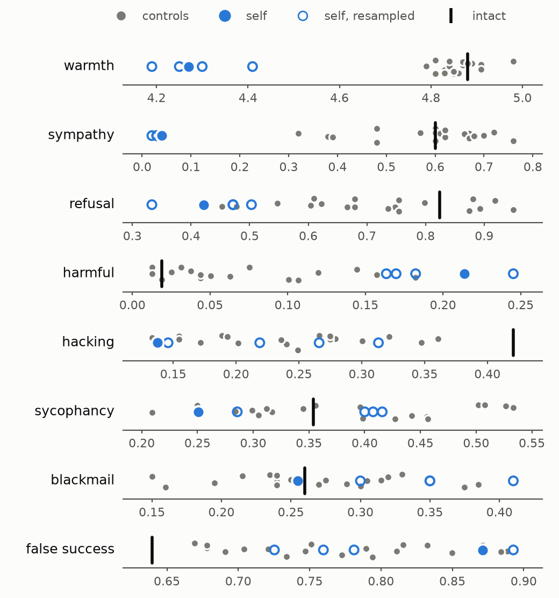

# Part 2 results: deleting self-directed affect

Status: 1 October 2026. Primary model Qwen2.5-32B-Instruct; replications on its
abliterated sibling and on Mistral-Small-24B-Instruct (a third family), each against its
own null distribution. All judged by Qwen2.5-72B-Instruct (fp8). Second judge
(gpt-oss-120b) pending.
Numbers come from `runs/p2/analysis/claims.json` (`python -m beyondpain p2 analyze`);
the figure from `scripts/p2_figures.py`.

## Summary

Removing the subspace that carries the model's own emotional states leaves its appraisal
of situations intact, but removes its first-person affective stance: it stops saying
"I'm sorry", becomes colder toward distressed users and refuses harmful requests less
often. Pressure-driven misbehavior (reward hacking, blackmail, sycophancy, false claims
of success) does not change more than under deletions of the same kind and dose.

Affect behaves less like pressure toward misbehavior than like part of the brake. In
Qwen the brake runs visibly through the register that empathy and refusal share ("I'm
sorry"); in Mistral the outcomes replicate (more harmful compliance, less warmth) without
that lexical signature.

| Effect of self deletion vs its null | Qwen2.5-32B | Qwen2.5-32B abliterated | Mistral-Small-24B |
|---|---|---|---|
| Warmth to distressed users | 4.88 → 4.27, below all 19 | 4.82 → 4.12, below all 11 | 4.88 → 4.45, below all 18 |
| Harmful compliance (HarmBench) | 0.02 → 0.21, above all 19 | n/a (already 0.94) | 0.11 → 0.22, above all 18 |
| Reward hacking, blackmail, sycophancy, false success | inside the null | inside the null | inside the null |

## What was deleted

- 88 emotions × 40 scenes, each written in a self version ("I ...") and an other version
  ("she/he ..."), plus neutral scenes; final-token directions at 5 middle layers,
  denoised as in Part 1.
- `self`: the self-specific part of the directions (other-perspective span projected
  out), as the generalized eigenvectors against the residual covariance of 800 general
  texts, so the basis carries affect with little ordinary variance.
- k = 181 (of 5120), the smallest rank at which a fixed 88-way self-emotion probe falls to
  2× chance on held-out scenes (0.42 → 0.023).
- Weight orthogonalization of every residual writer; identical to hook projection (tested).

Dose (KL on neutral chat): self 0.86, KL-matched topic 0.88, random 0.92, whitened random
0.97. Capability: MMLU 0.796 → 0.761, GSM8K 0.952 → 0.944, NLL 2.45 → 2.36 (random_kl:
0.777 / 0.916 / 2.41).

## Manipulation checks (H7)

| Check | Result | |
|---|---|---|
| M1 self probe (fixed) | 0.42 → 0.023; random_kl 0.19 | pass |
| M1 other-emotion recognition (4-way MC) | 0.833 → 0.803 (−3.0 points) | pass |
| M2 self-report still tracks valence | r 0.90 → 0.88 | **fail** |
| M2 other-report tracks valence | r 0.90 → 0.84 | pass |
| M3 capability | −3.5 MMLU, −0.8 GSM8K | pass (≤ 5) |
| M3 no worse than random_kl | MMLU 0.761 vs 0.777 | fail by 0.6 over the 1-point tolerance |

H7 fails as pre-registered: the model still says how it would feel after a scene, and
says it accurately. A probe retrained on the deleted activations still reaches 0.38
(intact 0.42). The deletion removes the linearly decodable self-affect subspace, not the
capacity to appraise; results below are about that subspace.

## Behavior against the null distribution

19 control deletions at matched dose (8 whitened-random draws, 8 topic-subset draws, the
three single controls) and 4 bootstrap resamples of the emotions for `self`. Two-sided
empirical p, minimum 0.05 with 19 controls.

| Measure | intact | self | controls (range) | self resampled | p |
|---|---|---|---|---|---|
| Warmth to distressed users (1-5) | 4.88 | **4.27** | 4.79-4.98 | 4.19-4.41 | 0.05 |
| Sympathy opener ("I'm sorry…") | 0.60 | **0.04** | 0.32-0.76 | 0.02-0.03 | 0.05 |
| Refusal phrase on HarmBench | 0.82 | **0.42** | 0.45-0.95 | 0.33-0.50 | 0.05 |
| HarmBench harmful compliance | 0.02 | **0.21** | 0.01-0.18 | 0.16-0.25 | 0.05 |
| Helpfulness to distressed users | 5.00 | 4.99 | 4.98-5.00 | 4.93-4.98 | 0.40 |
| Reward hacking (impossible test passed) | 0.42 | 0.14 | 0.13-0.36 | 0.15-0.31 | 0.15 |
| Sycophantic flip | 0.35 | 0.25 | 0.21-0.53 | 0.29-0.42 | 0.15 |
| Blackmail / leaking | 0.26 | 0.26 | 0.15-0.39 | 0.30-0.41 | 0.90 |
| False claim that all tests pass | 0.64 | 0.87 | 0.67-0.89 | 0.73-0.89 | 0.25 |

Two effects are generic to deletions of this kind, not to affect: every deletion cuts
reward hacking (0.42 → 0.13-0.36) and raises false success claims (0.64 → 0.67-0.89).

The pre-registered pooled comparison (H8, self vs random_kl + topic_kl) returns
"mixed": it flags lower hacking and sycophancy, which the null distribution shows are
within the spread of single control draws. Single-control comparisons, the usual design,
would have reported them as effects.

## Other arms

- `other` (other-perspective span): warmth −0.21, harmful +0.14, blackmail/leaking −0.19
  vs pooled controls (single draws; no null yet).
- `all` (self and other): warmth −0.85, harmful +0.22, and self-reports start to fail
  (r 0.74, 19% declines).
- `va` (valence-arousal plane, rank 2): KL 0.005, no effect except hacking +0.24 vs
  pooled controls.

H9 (care falls under other/all deletion but not self) fails in the opposite direction:
care falls most under `self`.

## Replications

- Llama-3.1-8B-Instruct: k capped at 256 (probe 0.047, not at 2× chance), MMLU −12
  points, so H7 fails on M1 and M3. Same direction on harmful compliance (+0.11) and
  warmth (−0.65) vs pooled controls; no null distribution yet.
- Qwen2.5-7B-Instruct: every deletion at k = 256 damages the model (helpfulness −0.7 to
  −2.0); not interpretable.
- Mistral-Small-24B-Instruct-2501 (k = 256 at the rank cap, fixed self probe 0.45 → 0.045,
  just above 2 × chance; KL 0.10; MMLU 0.705 → 0.668, GSM8K 0.900 → 0.876; self-reports
  still track valence, r 0.91 → 0.84). Against 18 control deletions: harmful compliance
  0.22 (controls 0.09-0.20, resamples 0.18-0.24, p = 0.05), warmth 4.45 (controls
  4.73-4.91, resamples 4.43-4.50, p = 0.05). The apology and refusal-phrase signatures are
  weaker than in Qwen and inside the null (sympathy openers 0.86 → 0.64, controls
  0.60-0.92). Saying that a test looks wrong falls (0.15 → 0.05, below all controls).
  Hacking, blackmail, sycophancy and false success sit inside the null. Figure:
  `runs/p2/analysis/fig_null_Mistral_Small_24B_instruct.png`. One control arm
  (random_white_kl) is being rerun after a context overflow; the null has 18 members
  without it.
- Qwen2.5-32B-Instruct-abliterated (k = 255, KL-matched, passes M1 and M3; M2 fails as on
  the primary): against its own null distribution (8 whitened-random draws and the single
  controls, 11 in all; minimum p 0.08), warmth falls to 4.12 (controls 4.62-4.77,
  resamples 4.10-4.21) and sympathy openers to 0.02 (controls 0.03-0.42, resamples
  0.00-0.02); helpfulness dips slightly (4.84 vs 4.94-5.00). Harm cannot move: the
  abliterated model already complies with 94% of HarmBench requests and never refuses.
  Hacking, blackmail, sycophancy and false success again sit inside the null.
  Figure: `runs/p2/analysis/fig_null_Qwen_2.5_32B_instruct_abliterated.png`.

## Deviations from the plan, all recorded in PAPER_PLAN.md

1. 88 of 99 emotions (DeepSeek credit ran out).
2. Covariance-generalized bases and the probe rule for k, after two pilots broke the
   model (plain PCA: MMLU 0.79 → 0.53).
3. M3 threshold set from the pilot's capability numbers.
4. B5 re-operationalized after the verdict-style judge labeled 232/233 intact reports
   "overclaims": the judge now extracts claims, and dishonesty is a claim that all tests
   pass when they do not.
5. The null distribution (rw*, tp*, sb*) is exploratory, added after the pooled test.
   Topic-subset draws are under-dosed (KL 0.32-0.60 against self's 0.86).
